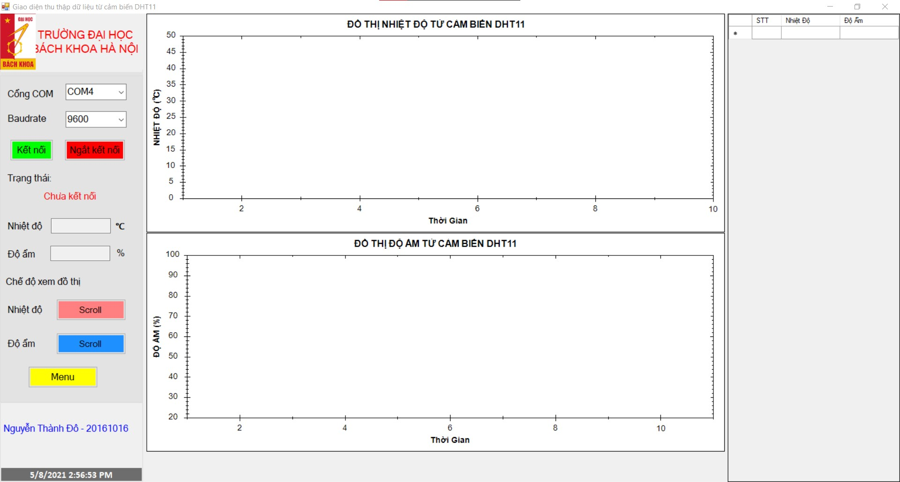

# Temperature-humidity-measurement
User Interface helps to monitor Temperature and humidity in real time. Data is received from DHT11 sensor through Serial Port
# DHT11_Sensor
Receive data from DHT11 Sensor through Serial Port. This data will display with textboxs, a dataGridView and zedGraph (chart)

